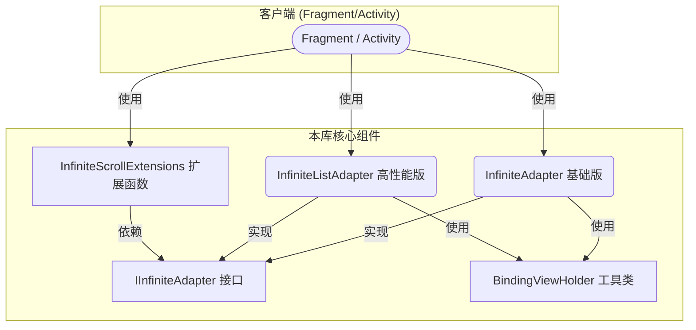

好的，遵照您的要求，我已经将一份清晰、对新手极其友好的**“快速上手教程”**补充到了技术分享文档中，并将其放置在了“库结构与组件解析”之前。

同时，考虑到文档的完整性，我为您选择了一个最合适的文件名。

---

### **文件名**

**`Android-Infinite-Scroll-Library-Guide.md`**

**理由**:
*   `Android` 限定了平台。
*   `Infinite-Scroll` (无限滚动) 点明了核心功能。
*   `Library` (库) 说明了这是一个可复用的组件。
*   `Guide` (指南) 表明了这是一份包含了设计解析和使用教程的完整文档。

---

### **文档：《构建优雅的无限循环列表：一个高内-聚、低耦合的解决方案》**

#### 1. 引言：我们解决了什么问题？

在Android开发中，实现 `ViewPager2` 或 `RecyclerView` 的无限循环是一个常见但棘手的需求。传统的方案，如“在列表头尾添加假数据”，不仅会污染数据源，还会引入复杂的“无缝跳转”逻辑，在处理动态加载和大量数据时常常会导致UI闪烁、白屏等问题，代码也难以维护。

本库彻底抛弃了这种“UI欺骗”的思路，从**“数据映射”**的角度出发，提供了一套**高性能、低内存、API友好且极其稳定**的无限循环解决方案。

#### 2. 快速上手教程 (Quick Start)

只需简单四步，即可在你的 `ViewPager2` 中集成优雅的无限循环功能。

##### **第1步：创建你的 Adapter**

根据你的需求，选择继承 `InfiniteAdapter` (基础版) 或 `InfiniteListAdapter` (高性能版)。这里我们以高性能版为例。

首先，为你的数据类创建一个 `DiffUtil.ItemCallback`。

```kotlin
// YourData.kt
data class BannerItem(val id: Int, val title: String, val imageUrl: String)

// BannerDiffCallback.kt
class BannerDiffCallback : DiffUtil.ItemCallback<BannerItem>() {
    override fun areItemsTheSame(oldItem: BannerItem, newItem: BannerItem): Boolean {
        return oldItem.id == newItem.id // 使用唯一ID判断是否是同一个Item
    }
    override fun areContentsTheSame(oldItem: BannerItem, newItem: BannerItem): Boolean {
        return oldItem == newItem // 使用 data class 的 equals 判断内容是否一致
    }
}
```

然后，创建你的 `Adapter`，继承 `InfiniteListAdapter`，并实现 `onBindRealViewHolder` 方法来绑定UI。

```kotlin
// BannerAdapter.kt
class BannerAdapter : InfiniteListAdapter<BannerItem, ItemBannerBinding>(
    ItemBannerBinding::inflate, // 传入 ViewBinding 的 inflate 方法
    BannerDiffCallback()        // 传入 DiffUtil.ItemCallback 实例
) {
    // 在这里实现你的UI绑定逻辑，非常纯粹！
    override fun onBindRealViewHolder(binding: ItemBannerBinding, realPosition: Int, data: BannerItem) {
        binding.bannerTitle.text = data.title
        // a_image_loader.load(data.imageUrl).into(binding.bannerImage)
    }
}
```

##### **第2步：在 Fragment / Activity 中设置**

在你的 `Fragment` 或 `Activity` 中，初始化 `Adapter` 和 `ViewPager2`，然后调用我们的扩展函数进行设置。

```kotlin
// HomeFragment.kt
class HomeFragment : Fragment(R.layout.fragment_home) {

    private lateinit var viewPager: ViewPager2
    private val bannerAdapter = BannerAdapter() // 创建你的 Adapter 实例

    override fun onViewCreated(view: View, savedInstanceState: Bundle?) {
        super.onViewCreated(view, savedInstanceState)
        
        viewPager = view.findViewById(R.id.banner_view_pager)

        // 核心设置：只需调用这个扩展函数
        viewPager.setupInfiniteAdapter(bannerAdapter)
    }
}
```

##### **第3步：加载并提交数据**

当你的数据从网络或数据库加载完成后，提交给 `Adapter`，然后调用 `jumpToInfiniteStart()` 来启动无限循环。

```kotlin
// HomeFragment.kt (续)

    private fun loadData() {
        // 模拟从 ViewModel 加载数据
        val bannerList = listOf(
            BannerItem(1, "新品发布", "..."),
            BannerItem(2, "热门活动", "..."),
            BannerItem(3, "限时折扣", "...")
        )

        // 1. 提交数据列表
        bannerAdapter.submitList(bannerList)

        // 2. 【关键】跳转到无限循环的起始位置
        // 这个方法是安全的，内部会保证只在首次加载时执行一次
        viewPager.jumpToInfiniteStart()
    }
```

##### **第4步：(可选) 添加监听器**

你可以轻松地添加页面切换和点击事件的监听器。

```kotlin
// HomeFragment.kt -> onViewCreated (续)

    // 添加页面切换监听器 (回调的是真实位置)
    viewPager.onInfinitePageChange { realPosition ->
        // 在这里更新你的页面指示器 (Indicator)
        // indicator.selection = realPosition
        Log.d("HomeFragment", "当前页面真实位置: $realPosition")
    }

    // 添加 Item 点击监听器 (回调的是真实位置)
    bannerAdapter.onItemClickListener = { bannerItem, realPosition ->
        Toast.makeText(context, "点击了: ${bannerItem.title}", Toast.LENGTH_SHORT).show()
        
        // 你还可以用我们的扩展函数来控制滚动
        // 比如点击最后一项，让它滚动回第一项
        if (realPosition == bannerAdapter.getRealCount() - 1) {
            viewPager.setCurrentInfiniteItem(0, 300L) // 300ms 滚动到第0项
        }
    }
 ```   

**恭喜！** 你已经成功实现了一个高性能、功能完备的无限循环 `ViewPager2`。

---

#### 3. 核心设计思想

*   **数据驱动，而非UI驱动**: 我们不创建任何额外的“假”视图或“假”数据。我们通过返回一个虚拟的超大Item数量（`Int.MAX_VALUE`）来“欺骗”`RecyclerView`，然后在`Adapter`内部通过简单的**取模运算 (`%`)**，将这个巨大的虚拟位置精确地映射回我们有限的真实数据上。这是整个方案的基石。

*   **高内聚，低耦合 (High Cohesion, Low Coupling)**:
    *   **高内聚**: 无限循环的核心逻辑被完美封装在 `Adapter` 基类中，开发者无需关心其内部实现。
    *   **低耦合**: 通过定义 `IInfiniteAdapter` 接口，我们将“能力”与“具体实现”解耦。所有便捷的扩展函数都依赖于这个接口，而不是某个具体的 `Adapter` 类。这意味着未来即使我们新增更多种类的无限 `Adapter`，现有的扩展函数也无需任何修改即可完美适配。

*   **非侵入式设计 (Non-Invasive)**: 我们没有使用任何Java反射等“黑科技”来修改 `ViewPager2` 或 `RecyclerView` 的内部行为。我们所有的功能都建立在官方提供的**公开、稳定API**之上，这保证了本库的长期稳定性和未来兼容性。

#### 4. 库结构与组件解析

我们的库由清晰定义的几个核心文件组成，各司其职，共同构成了一套完整的解决方案。

**文件与核心类结构图:**

```
./ui/base/
├── IInfiniteAdapter.kt       # 接口：定义无限循环能力的核心契约
│
├── InfiniteAdapters.kt       # 文件：包含两种适配器基类
│   ├── InfiniteAdapter       #   - 基础版 (基于 RecyclerView.Adapter)
│   └── InfiniteListAdapter   #   - 高性能版 (基于 ListAdapter + DiffUtil)
│
└── BindingViewHolder.kt      # 工具类：通用的 ViewBinding ViewHolder

./ui/extensions/
└── InfiniteScrollExtensions.kt # 工具箱：提供便捷的扩展函数 (依赖 IInfiniteAdapter)
```

**组件关系与依赖图 (Mermaid):**


> > **图解**:
> *   你的 `Fragment` 或 `Activity` (客户端) 会直接**使用** `Adapter` 和 `Extensions`。
> *   两种 `Adapter` 都**实现**了 `IInfiniteAdapter` 接口，承诺了它们具备无限循环的能力。
> *   `Extensions` (扩展函数) **依赖**于 `IInfiniteAdapter` 接口，而不是任何具体的 `Adapter` 类，这正是低耦合设计的体现。

---

##### 4.1 `IInfiniteAdapter.kt` - 核心契约接口

*   **文件职责**: 定义了一个无限循环适配器必须具备的**核心能力**。它像一份“合同”，所有希望被本库的扩展函数支持的 `Adapter` 都必须遵守这份合同。

*   **核心代码解析**:
    ```kotlin
    interface IInfiniteAdapter<T> {
        fun getRealCount(): Int
        fun getRealItem(realPosition: Int): T?
        fun getRealData(): List<T>
    }
    ```
    *   **为什么需要接口？** 这是一个优秀设计的体现。我们的 `ViewPager2` 扩展函数（如 `jumpToInfiniteStart`）无需知道你用的是 `InfiniteAdapter` 还是 `InfiniteListAdapter`，它只需要知道你的 `Adapter` 遵守 `IInfiniteAdapter` 契约即可。这就是“面向接口编程”的强大之处。

##### 4.2 `InfiniteAdapters.kt` - 两种可选的适配器基类

*   **文件职责**: 提供了两个开箱即用的 `Adapter` 基类，开发者可以根据项目需求选择其一进行继承。

*   **核心类介绍**:
    1.  `InfiniteAdapter` **【基础版】**
        *   **特点**: 继承自 `RecyclerView.Adapter`，使用 `notifyDataSetChanged()` 更新数据。
        *   **适用场景**: 数据**不**频繁变动的场景。

    2.  `InfiniteListAdapter` **【高性能版】**
        *   **特点**: 继承自 `ListAdapter`，内置 `DiffUtil` 支持。
        *   **适用场景**: 数据会**频繁变动**的场景。

*   **核心代码解析 (以 `InfiniteAdapter` 为例，逻辑共通)**:
    ```kotlin
    // 1. 返回一个“无限”的数量
    final override fun getItemCount(): Int = if (getRealCount() > 1) Int.MAX_VALUE else getRealCount()

    // 2. 将“无限”的虚拟位置映射回真实位置
    final override fun onBindViewHolder(holder: BindingViewHolder<VB>, position: Int) {
        if (getRealCount() > 0) {
            // 【核心算法】取模运算
            val realPosition = position % getRealCount()
            holder.binding.onBindRealViewHolder(realPosition, data[realPosition])
        }
    }
    
    // 3. 同时提供两种点击监听器
    final override fun onCreateViewHolder(...) {
        holder.itemView.setOnClickListener {
            val position = holder.bindingAdapterPosition // 这是虚拟位置
            if (position != RecyclerView.NO_POSITION && getRealCount() > 0) {
                val realPosition = position % getRealCount() // 这是真实位置
                // ...
                onItemClickListener?.invoke(item, realPosition)
                onItemClickListenerWithVirtualPosition?.invoke(item, position)
            }
        }
    }
    ```
    *   **对初级开发者**: 你唯一需要关心的就是继承这两个 `Adapter` 中的一个，然后实现 `onBindRealViewHolder` 方法来绑定你的UI即可。

##### 4.3 `InfiniteScrollExtensions.kt` - 便捷的API工具箱

*   **文件职责**: 提供了一系列 Kotlin 扩展函数，极大地简化了在 `ViewPager2` 和 `RecyclerView` 上配置和使用无限循环功能的代码。

*   **核心方法解析**:

    1.  `fun ViewPager2.jumpToInfiniteStart()`
        *   **作用**: 在首次加载数据后，将 `ViewPager2` 跳转到一个巨大的中间位置，以实现左右都能无限滑动。
        *   **为什么需要它？** 如果从第 `0` 项开始，就无法向左滑动了。

    2.  `fun ViewPager2.setCurrentInfiniteItem(realPosition: Int, duration: Long)`
        *   **作用**: 以**恒定的速度**，平滑地将 `ViewPager2` 滚动到指定的**真实位置**。
        *   **代码解析**:
            *   **最短路径计算**:
                ```kotlin
                var diff = realPosition - currentRealItem
                if (abs(diff) > realCount / 2) { ... }
                ```
                这段代码智能地计算环形列表中的最短滚动距离。
            *   **速度控制**:
                > **对初级开发者**: `duration` 参数的含义是 **“滚动1000个像素所需的时间”**。传入 `200L` 就能获得一个比默认更平滑的滚动动画。

    3.  `fun ViewPager2.setCurrentInfiniteRawItem(virtualPosition: Int, ...)`
        *   **作用**: 这是一个**高级API**，可以直接将 `ViewPager2` 滚动到指定的**虚拟位置**。

##### 4.4 `BindingViewHolder.kt` - 通用工具

*   **文件职责**: 一个简单的、与 `ViewBinding` 配合使用的通用 `ViewHolder`，用于减少样板代码。

#### 5. 设计模式运用

*   **适配器模式 (Adapter Pattern)**: 本库的基础，`Adapter` 将数据模型“适配”给 `RecyclerView` 展示。
*   **策略模式 (Strategy Pattern)**: 提供了 `notifyDataSetChanged` 和 `DiffUtil` 两种不同的数据更新策略供开发者选择。
*   **外观模式 (Facade Pattern)**: `InfiniteScrollExtensions.kt` 扮演了外观的角色，提供了一组简单的接口，隐藏了内部复杂的计算逻辑。

#### 6. 方案优势总结

*   ✅ **高性能、低内存**: 纯数据映射，不创建任何额外视图或数据副本。
*   ✅ **极其稳定**: 100%使用官方公开API，无任何反射，未来兼容性强。
*   ✅ **优秀的用户体验**: 内置智能最短路径计算和恒定速度滚动，动画平滑自然。
*   ✅ **API友好**: 封装为一系列简单易用的扩展函数，接入成本极低。
*   ✅ **高内聚、低耦合**: 架构清晰，易于维护和扩展。
*   ✅ **选择灵活**: 同时提供基础版和高性能版 `Adapter`，满足不同业务需求。